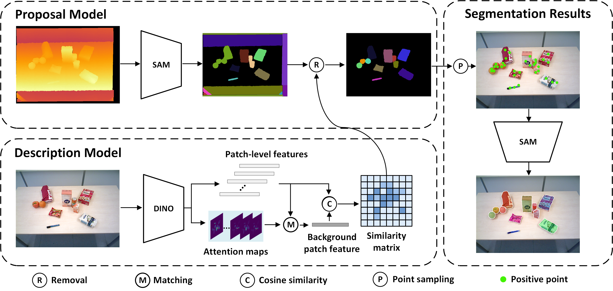
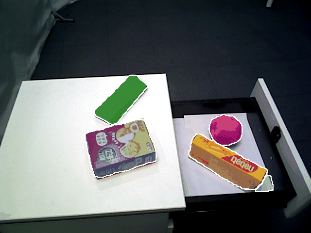
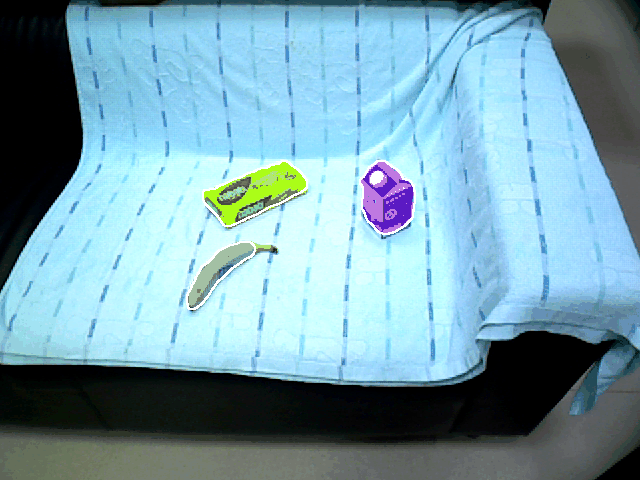

# ZISVFM: Zero-Shot Object Instance Segmentation in Indoor Robotic Environments with Vision Foundation Models

## Abstract
Service robots operating in unstructured environments must effectively recognise and segment unknown objects to enhance their functionality. Traditional supervised learning-based segmentation techniques require extensive annotated datasets, which are impractical for the diversity of objects encountered in real-world scenarios. Unseen Object Instance Segmentation (UOIS) methods aim to address this by training models on synthetic data to generalize to novel objects, but they often suffer from the simulation-to-reality gap. This paper introduces a novel approach ZISVFM for solving UOIS by leveraging the powerful zero-shot capability of the segment anything model (SAM) and explicit visual concepts from a self-supervised vision transformer (ViT). The proposed framework operates in three stages. Initially, it generates object-agnostic mask proposals from colorized depth images using the SAM. Subsequently, it refines these proposals by removing non-object masks based on size characteristics and explicit visual concepts from a self-supervised ViT. Finally, the framework utilizes K-Medoids clustering to generate point prompts within the object proposal regions. These prompts guide the SAM towards precise object segmentation. By integrating SAM's generalization capabilities with ViT's explicit information, the methodology can effectively and accurately segment objects of interest in a scene. Experimental validation on two benchmark datasets and in a real-world environment demonstrates the effectiveness and practical utility of proposed ZISVFM.

## Method Overview

Overview of the proposed methodology. This approach employs two vision foundation models: SAM for segmentation and ViT, trained with DINO, for feature description in a scene. The process consists of three main stages: 1) Generating object-agnostic mask proposals using SAM on colorized depth images; 2) Refinement of object masks by removing non-object masks based on observed characteristics and explicit visual concepts from a self-supervised ViT; 3) Point prompts derived from clustering centres within each object's proposal further optimise object segmentation performance.

## Installation
To install and run this project using a Conda environment, follow these steps:
1. **Clone the Repository**
   ```bash
   git clone https://github.com/Yinmlmaoliang/zisvfm.git
   cd zifvfm
   ```
2. **Create and Activate a Conda Environment**
   ```bash
   conda create --name zisvfm python=3.9  # Replace 'myenv' with your preferred env name
   conda activate zisvfm
   ```
3. **Install Dependencies**
   ```bash
   pip install -r requirements.txt
   ```
## Usage
### Demo
We have provided a `demo.ipynb` jupyter notebook to easily run predictions using our model.
### Testing on the OCID dataset and the OSD dataset.
The code used to evaluate model performance in this project is from [UOAIS](https://github.com/gist-ailab/uoais). Thanks to the authors for sharing the code!
## Visualisation Results
|  |  |  |
|:-:|:-:|:-:|
